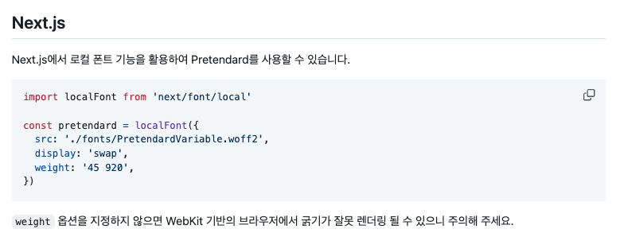

얼마전 새로운 프로젝트를 시작하면서 Next.js에서 폰트를 적용하게 되었는데
이전에 블로그 개발할 때처럼 여러 문서를 찾아다니는 저를 발견하고(...) 정리를 해보려고 해요.

이 글은 다음과 같은 버전을 기준으로 작성되었어요.

- `Next.js@15.1.7`
- `TailwindCSS@3.4.1`
- `Storybook@8.5.5`

## Next.js 에서 폰트 설정하기

[Next.js 공식 문서](https://nextjs.org/docs/app/building-your-application/optimizing/fonts)에서는 폰트를 최적화하는 방법으로 Google Font와 Local Font 두가지를 설명하고 있어요.

현재 프로젝트에서는 Google Font에 없는 Pretendard를 폰트로 사용해서 Local Font를 설정하는 방식에 대해서 알아볼게요.

먼저 `next/font/local` 을 import해서 저장한 폰트 파일이 위치한 경로를 지정해주세요.
Next.js 팀은 variable fonts를 사용하는 것을 권장하고 있어요.

저는 [프리텐다드 Github](https://github.com/orioncactus/pretendard?tab=readme-ov-file) 에서 다운로드한 `PretendardVariable.woff2` 폰트 파일을 `public/fonts/` 디렉토리에 넣어 경로를 지정했어요.
(공식문서에서는 `app/` 디렉토리에 폰트파일을 함께 위치할 수도 있다고 소개하고 있어요.)

```tsx
// app/layout.tsx

import localFont from "next/font/local";

const pretendard = localFont({
	src: "./PretendardVariable.woff2"
	display: "swap",
	weight: "45 920",
	variable: "--font-pretendard",
})
```

[프리텐다드의 Github](https://github.com/orioncactus/pretendard?tab=readme-ov-file#nextjs)에서 Next.js를 사용하는 방법에 대해 다음과 같이 설명하고 있어요.


> **localFont 내부 프로퍼티**
>
> - src: 폰트 파일의 경로를 지정
> - display: 폰트가 표시되는 방법을 결정 [MDN font-dispay](https://developer.mozilla.org/en-US/docs/Web/CSS/@font-face/font-display)
> - weight: 폰트의 굵기 범위를 지정
> - variable: 입력한 변수를 CSS 변수로 설정
>   그 외의 Font 함수와 관련된 인자들은 [여기](https://nextjs.org/docs/app/api-reference/components/font)에서 확인해보세요.

이렇게 `localFont`를 설정했다면 app/layout.tsx`에서 다음과 같이 사용할 수 있어요.

```tsx
// app/layout.tsx

import localFont from "next/font/local";

const pretendard = localFont({
	...
})

export default function RootLayout({
	children,
}: Readonly<{
	children: React.ReactNode;
}>) {
	return (
		<html lang="kr" className={`${pretendard.className}`}>
			<body>{children}</body>
		</html>
	);
}
```

`localFont`는 폰트를 사용할 수 있도록 `pretendard.className`와 같이 자동으로 클래스 이름을 생성해 사용할 수 있도록 해요.
`.className` 방식을 사용하면 폰트를 전역적으로 적용시킬 수 있어요.

## Tailwind CSS에서 variable 적용하기

`localFont`에서 설정한 `variable`을 Tailwind에 적용해 전역 또는 부분적으로 폰트를 적용할 수도 있어요.

```tsx
// app/layout.tsx
export default function RootLayout(...) {
	return (
		// pretendard.className 대신 pretendard.variable 사용
		<html lang="kr" className={pretendard.variable}>
			<body>{children}</body>
		</html>
	);
}
```

`html` 태그에 `className`으로 `variable`을 추가해주세요.

```typeScript
// tailwind.config.ts
import type { Config } from "tailwindcss";

export default {
	content: [
		...
	],
	theme: {
		extend: {
			fontFamily: {
				// font-pretendard 등록
				pretendard: ["var(--font-pretendard)"],
			},
		},
	},
	plugins: [],
},
```

그리고 `tailwind.config.ts`에서 `fontFamily`로 `pretendard`를 추가해줄게요.
이렇게 하면 `font-pretendard`라는 클래스로 폰트 스타일을 추가할 수 있어요.

다시 `app/layout.tsx`로 돌아와서,

```tsx
// app/layout.tsx
export default function RootLayout(...) {
	return (
		// font-pretendard tailwind class 추가
		<html lang="kr" className={`${pretendard.variable} font-pretendard`}>
			<body>{children}</body>
		</html>
	);
}
```

이렇게 작성하게 되면 `pretendard` 폰트를 전역으로 적용할 수 있어요.
폰트의 등록 흐름을 처음부터 순서대로 설명해볼게요.

1. `./PretendardVariable.woff2` 폰트 파일을
   `localFont`를 통해 `--font-pretendard` 라는 이름으로 `variable` 변수에 설정했어요.

```tsx
// app/layout.tsx
const pretendard = localFont({
	src: "./PretendardVariable.woff2"
	variable: "--font-pretendard"
})
```

2. 설정한 `variable`을 전역으로 설정 가능하도록 `html`에 `className`으로 등록했어요.

```tsx
// app/layout.tsx
export default function RootLayout() {
  return (
    <html lang="kr" className={pretendard.variable}>
      <body>{children}</body>
    </html>
  );
}
```

3. `tailwind.config.ts`에서 `variable`의 값(`./PretendardVariable.woff2`)을 `fontFamily`에 `pretendard`라는 이름으로 저장했어요.

```typescript
// tailwind.config.ts
export default {
	...
	theme: {
		extend: {
			fontFamily: {
				pretendard: ["var(--font-pretendard)"],
			},
		},
	},
	...
},
```

1. 저장한 `font-pretendard`이름의 `fontFamily`를 적용하고 싶은 노드에 추가했어요.

```tsx
// app/layout.tsx
export default function RootLayout() {
  return (
    <html lang="kr" className={`${pretendard.variable} font-pretendard`}>
      <body>{children}</body>
    </html>
  );
}
```

이 과정을 통해 Next.js 프로젝트에서 Tailwind CSS 를 통해 폰트를 적용할 수 있게 됐어요.

## Storybook에서 폰트 설정하기

저는 컴포넌트 문서화를 위해 Storybook을 사용하고 있는데,
페이지에 적용된 폰트를 Storybook에서도 확인할 수 있도록 폰트를 추가해 볼게요.

Storybook도 Next.js 환경에서 실행되기 때문에 마찬가지로 폰트를 사용할 수 있도록 `localFont`를 통해 `variable`로 등록해야 해요.

앞으로 폰트를 추가할 때마다 `localFont`를 각각 등록해줘야 하기 때문에 `const pretendard = localFont({})`를 분리해 재사용하고 폰트들을 모아서 관리할 수 있도록 분리해볼게요.

```tsx
// app/fonts.ts
import localFont from "next/font/local";

export const pretendard = localFont({
  src: "../public/fonts/PretendardVariable.woff2",
  display: "swap",
  weight: "45 920",
  variable: "--font-pretendard",
});

// 폰트 추가시 하위에 작성
// ...
```

앞에서 작성한 `app/layout.tsx`도 이렇게 변경할 수 있어요.

```tsx
import { pretendard } from "./fonts";

export default function RootLayout() {
  return (
    <html lang="kr" className={`${pretendard.variable} font-pretendard`}>
      <body>{children}</body>
    </html>
  );
}
```

`.storybook/preview.ts`는 작성한 스토리 파일들에 대한 전역 설정을 정의하는 파일이에요.
`preview.ts`의 여러 속성들 중 `decorators`는 렌더링 될 스토리를 감싸 스타일이나 레이아웃을 적용할 수 있어요.

```tsx
import React from "react";
import type { Preview } from "@storybook/react";
import { pretendard } from "../app/fonts";
import "../app/globals.css";

const preview: Preview = {
  parameters: {
    controls: {
      matchers: {
        color: /(background|color)$/i,
        date: /Date$/i,
      },
    },
    // ...
  },
  decorators: [
    (Story) => (
      <div className={`${pretendard.variable} font-pretendard`}>
        <Story />
      </div>
    ),
  ],
};

export default preview;
```

`layout.tsx`와 동일한 방법으로 `font-pretendard`를 적용했어요.

이렇게 적용했다면 아마 에러가 발생할거에요, 그 이유는 `decorators`를 통해 컴포넌트를 반환하기 때문에 `preview.ts`를 `preview.tsx`로 변경해줘야 해요.

이제 `.storybook/main.ts`에서 `staticDirs`를 통해 `local font`가 위치한 디렉토리를 지정할게요.

```typescript
const config: StorybookConfig = {
  // ...
  staticDirs: [
    {
      from: "../public/fonts",
      to: "public/fonts",
    },
  ],
};
```

`from` 프로퍼티는 `.storybook` 디렉토리를 기준으로 상대 경로이고,
`to` 프로퍼티는 루트 디렉토리를 기준으로 해요.

이렇게 하면 Storybook에도 폰트를 적용할 수 있어요.

![[Pasted image 20250218225332.png]]
`pretendard` 폰트가 Storybook에 작성한 Button에 적용된 모습.

## 출처

[Font Optimization](https://nextjs.org/docs/app/building-your-application/optimizing/fonts)
[Pretendard Github](https://github.com/orioncactus/pretendard)
[Storybook 컴포넌트에 Next.js에서 적용했던 로컬 폰트 그대로 적용하기 (feat. Tailwind)](https://www.itsmo.dev/storybook-font/)
[Next.js LocalFont 적용하기 (feat. Pretendard)](https://velog.io/@pmthk__/Next.js-LocalFont-%EC%A0%81%EC%9A%A9%ED%95%98%EA%B8%B0-feat.-Pretendard)
[🧱Next.js 14에 Pretendard 폰트 적용하기](https://dev.to/algoorgoal/nextjs-tailwindcsse-pretendard-ponteu-jeogyonghagi-1g87)
